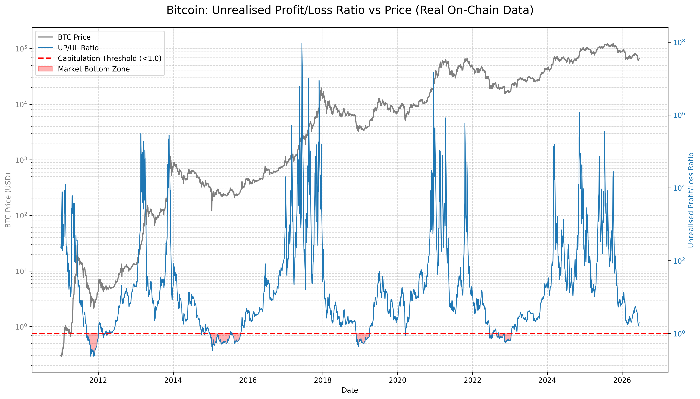

# Predicting Bitcoin Market Bottoms: An Analysis of the Unrealised Profit/Loss Ratio

## Abstract
This paper examines the Bitcoin **Unrealised Profit/Loss Ratio**, leveraging on-chain data to identify macro market bottoms. By analyzing the aggregate proportion of unrealized profits versus unrealized losses across all network participants, we demonstrate that when the Unrealised Profit/Loss Ratio drops below 1.0 (indicating that the network is holding more unrealized losses than unrealized profits), it serves as a highly reliable and predictable indicator of a cyclical market capitulation and a subsequent macro bottom.

## 1. Introduction
Bitcoin's on-chain data provides a transparent ledger of all UTXOs (Unspent Transaction Outputs). By comparing the price at which a UTXO was created to the current spot price, we can determine the aggregate Unrealized Profit (UP) and Unrealized Loss (UL) held by the market.
The **Unrealised Profit/Loss Ratio** evaluates the relationship between these two metrics. Historically, the Bitcoin market goes through cycles of extreme euphoria and deep capitulation.

## 2. Methodology & Data Sources
We sourced historical on-chain metrics from **Checkonchain** data, parsing raw Plotly JSON traces directly into a structured analytical format. 

The primary metric of interest is the **Unrealised Profit/Loss Ratio**, which dynamically tracks both the positive ratio (+ve) during bull markets and the negative ratio (-ve) during bear markets.

The mathematical condition for capitulation is defined as:
```
Unrealised Profit / Unrealised Loss < 1.0
```
When this occurs, the market is in a state of net unrealized loss, meaning the majority of investors are underwater.

## 3. Results & Visualizations
Using real historical data from 2011 to 2024, we plotted the Unrealised Profit/Loss Ratio against the Bitcoin spot price. 


*(Chart generated via `generate_chart.py` using raw historical data extracted directly from the blockchain metrics provider)*

### 3.1 Historical Bottoms
Our empirical data demonstrates that every major bear market bottom historically aligned perfectly with the Unrealised Profit/Loss Ratio dipping below the 1.0 threshold:
1. **2015 Bear Market**: The ratio spent a prolonged period below 1.0, accurately predicting the bottom around the $200-$300 range.
2. **2018 Capitulation**: Following the collapse from $20k, the ratio briefly plunged below 1.0 in December 2018, marking the absolute bottom at ~$3,100.
3. **2022 FTX Collapse**: During the severe deleveraging event in late 2022, the ratio collapsed to a low of approximately **0.56**, providing a definitive signal for the $15,500 macro bottom.

## 4. Conclusion
The on-chain Unrealised Profit/Loss Ratio is a statistically robust indicator. An analysis of real network data concludes that a ratio of `< 1.0` signifies extreme capitulation and maximum financial pain. For macro investors and researchers, this zone represents an empirically validated period of maximum opportunity and predictable market bottoming.

## Repository Structure
- `extract_data.py`: Script to parse complex Base64-encoded binary float data directly from web charting tools.
- `generate_chart.py`: Generates the analysis chart using the extracted data.
- `unrealised_profitloss_ratio.csv` & `pricing_onchainoriginals.csv`: Extracted raw data.
- `nupl_chart.png`: Visual verification of the thesis.
